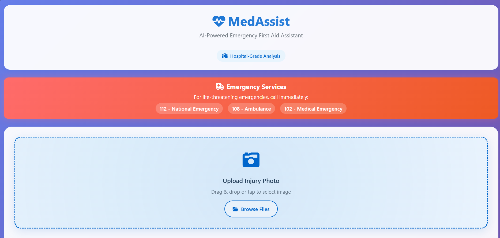
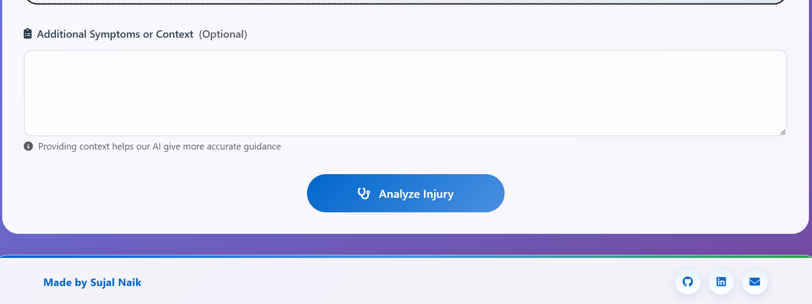

## MedAssist — AI-Powered First Aid Assistant

MedAssist is a lightweight web app that analyzes injury photos and generates safe, actionable first-aid guidance. It uses a Flask backend and Google’s Gemini multimodal model to process an image and optional text description, then returns clear recommendations and trusted resources.

The UI is mobile-friendly, accessible, and designed for quick uploads and readable results.

> Important: This app is for informational and educational purposes only and does not replace professional medical advice, diagnosis, or treatment.

---

### Screenshots

Uploading and analyzing an image:



Results and footer preview:



---

### Features
- Modern, responsive UI with drag-and-drop image upload
- Optional text description to improve analysis context
- Image validation and size limits; optimized preview
- Clean results panel with steps, warnings, and helpful resources
- Backend endpoint to analyze images using Gemini 1.5 Flash
- Safe generation settings and guarded MIME handling

---

### Tech Stack
- Backend: Flask (Python)
- AI Model: Google Gemini 1.5 Flash via `google-generativeai`
- Frontend: Bootstrap 5, Font Awesome 6
- Static uploads: saved under `static/uploads`

---

### Project Structure
```
.
├─ app.py                      # Flask app and AI integration
├─ requirements.txt            # Python dependencies
├─ templates/
│  └─ index.html               # UI (upload form, preview, results)
├─ static/
│  └─ uploads/                 # Uploaded images (created automatically)
└─ README.md
```

---

### Prerequisites
- Python 3.10+ recommended
- A Google AI Studio API key with access to Gemini 1.5 models

Create an API key at Google AI Studio, then keep it private (never commit it).

---

### Setup
1) Clone and enter the project
```bash
git clone <your-repo-url>
cd <your-repo-folder>
```

2) Create and activate a virtual environment
```bash
# Windows (PowerShell)
python -m venv .venv
.venv\Scripts\Activate.ps1

# macOS/Linux
python3 -m venv .venv
source .venv/bin/activate
```

3) Install dependencies
```bash
pip install -r requirements.txt
```

4) Provide your API key (recommended: environment variable)
```bash
# Windows (PowerShell)
$env:GEMINI_API_KEY="YOUR_API_KEY_HERE"

# macOS/Linux
export GEMINI_API_KEY="YOUR_API_KEY_HERE"
```

The app also respects `GOOGLE_API_KEY`. In `app.py`, there is a placeholder `API_KEY` variable—leave it empty and prefer environment variables.

5) Run the app
```bash
python app.py
```

Visit http://127.0.0.1:5000

---

### How It Works
- Upload an image (JPEG/PNG/WebP). Max upload size: 16 MB.
- Optionally add a description to provide context (e.g., when/how the injury occurred).
- The backend saves the image, validates MIME type, and sends the image + text to Gemini 1.5 Flash.
- The model returns structured guidance, which the frontend displays in the results panel.

Key backend files/functions:
- `generate_gemini_response(text_input, image_path)`: builds a multimodal prompt and calls Gemini.
- `input_image_setup(file_path)`: validates the image and prepares the binary payload.
- `POST /analyze`: accepts `image` (file) and `description` (text), returns JSON with `response` and `image_path`.

---

### API
Endpoint: `POST /analyze`

Form fields:
- `image` (file, required)
- `description` (text, optional)

Response (200):
```json
{
  "response": "<model-output>",
  "image_path": "/static/uploads/<filename>"
}
```

Errors:
- 400 — missing or empty file
- 500 — model or processing error (message in `error`)

Example (cURL):
```bash
curl -X POST http://127.0.0.1:5000/analyze \
  -F "image=@/path/to/injury.jpg" \
  -F "description=Cut on forearm after fall"
```

---

### Frontend integration (replace mock with live call)
The current `templates/index.html` simulates analysis for demo UX. To use the live backend, replace the simulated section with a fetch call inside the submit handler:

```javascript
const formData = new FormData();
formData.append('image', imageInput.files[0]);
formData.append('description', document.getElementById('description').value || '');

const res = await fetch('/analyze', { method: 'POST', body: formData });
const data = await res.json();
if (!res.ok) throw new Error(data.error || 'Analysis failed');
displayResults(data.response);
```

---

### Configuration
- Max upload size: change `app.config['MAX_CONTENT_LENGTH']` in `app.py`
- Upload folder: `app.config['UPLOAD_FOLDER']` (default `static/uploads`)
- Model and generation settings: `model = genai.GenerativeModel(...)` and `generation_config`
- Safety settings: tuned in `safety_settings` to block harmful outputs

---

### Security Notes
- Do not hardcode API keys. Prefer environment variables.
- Validate MIME types (already implemented) and sanitize filenames (using `secure_filename`).
- Consider enabling authentication and HTTPS for production deployments.

---

### Deploying
- Render, Railway, Fly.io, or Google Cloud Run work well for Flask apps.
- Ensure environment variables are set in your hosting provider.
- Configure a persistent or ephemeral storage strategy for `static/uploads` (or move to cloud storage like GCS/S3 if needed).

---

### Troubleshooting
- Missing API key: set `GEMINI_API_KEY` or `GOOGLE_API_KEY` before running.
- 413 Request Entity Too Large: reduce image size or increase `MAX_CONTENT_LENGTH`.
- Invalid image type: ensure the file is JPEG/PNG/WebP.
- CORS issues: if hosting frontend separately, add CORS headers to Flask.

---

### License and Disclaimer
This project is provided as-is for educational purposes. It is not a medical device. Always seek professional medical advice for serious injuries or emergencies.

---

### Author
Made with ❤️ by Sujal Naik

- GitHub: [bsujalnaik](https://github.com/bsujalnaik)
- LinkedIn: https://www.linkedin.com/in/bsujalnaik/

If you use or extend this project, a star and a mention are appreciated!
